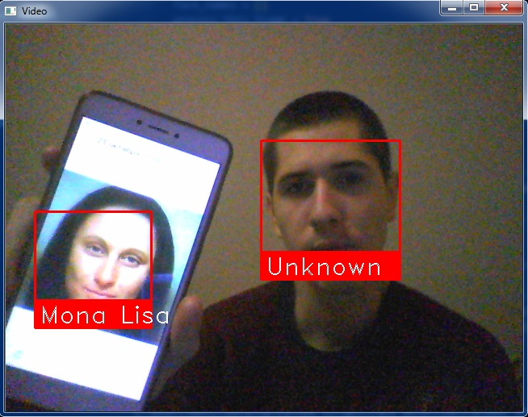

# WebCam Face Recognition

This is simple example of real-time face recognition via webcam, based on [face_recognition](https://github.com/ageitgey/face_recognition)



## Installation and Usage
1. Clone this repository
2. Install module from pypi using **pip3** (or **pip2** for Python 2):
   ```bash
   pip3 install face_recognition
   ```
   If you encounter problems, see the [source instructions](https://github.com/ageitgey/face_recognition#installation).
3. Put photos of people whose faces you will recognize on the webcam in the "*photos*" folder. **Important**: The file must be like "*person_name.jpg*"
4. Start recognation:
    ```bash
    python face_det_n_rec.py
    ```
5. (*Optional*) After the first run, you can delete "*photos*" from the photos folder. Face descriptors are saved in the "*faces*" folder.
